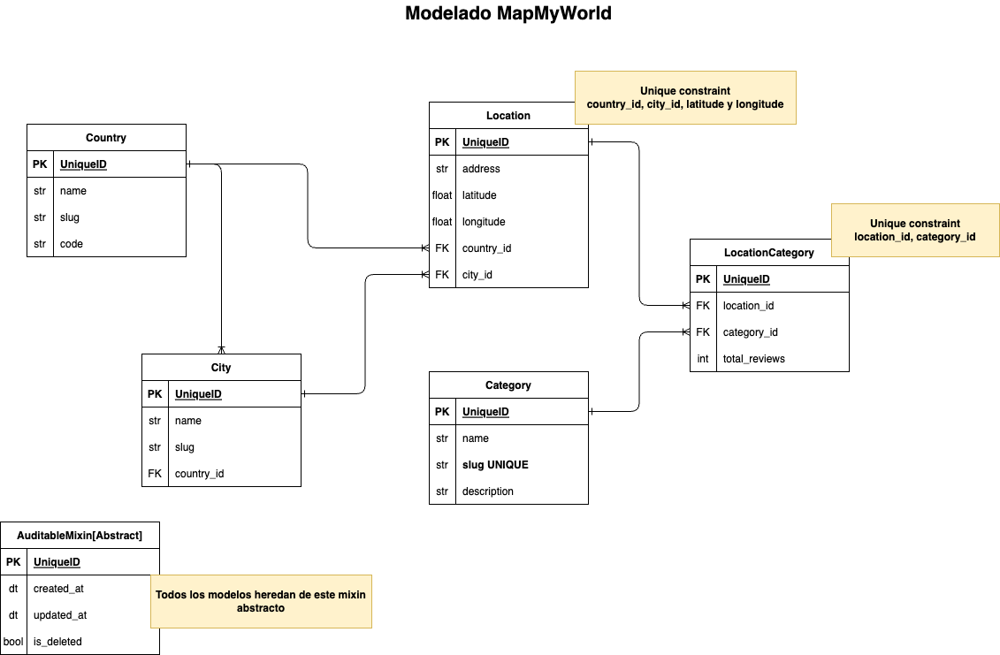

# Map my world

Map my world is a service built with FastAPI and also utilizes the ORM and directory structure proposed by Django

In order for the project correctly work, please consider you to use::

- Docker version >= 23.0.5, build bc4487a
- Docker Compose >= version v2.17.3

# Installation

1. First, clone this repository:

```bash
git clone https://github.com/argemsy/map_my_world.git
```

2. Copy the environment vars:

```bash
cp .env.dist .env
```

## Environment variables

| Variable                  | Description                                         | required |
| ------------------------- | --------------------------------------------------- | -------- |
| DATABASE_URL              | Principal Project BD                                | true     |
| DJANGO_SETTINGS_MODULE    | The location of the base settings                   | true     |
| DEBUG                     | Define values to settings DEBUG                     | true     |
| SECRET_KEY                | Define values to settings SECRET_KEY                | true     |
| DJANGO_ALLOW_ASYNC_UNSAFE | Define values to settings DJANGO_ALLOW_ASYNC_UNSAFE | true     |

3. Init project:

```bash
make init
```

4. Show containers:

```bash
make ps
```

This results in the following running containers:

```bash
docker compose ps
NAME                    IMAGE               COMMAND                  SERVICE             CREATED             STATUS              PORTS
map_my_world_api        map_my_world-api    "/bin/sh -c 'python …"   api                 3 seconds ago       Up 2 seconds        0.0.0.0:8500->8500/tcp
map_my_world_postgres   postgres:latest     "docker-entrypoint.s…"   postgres            3 seconds ago       Up 2 seconds        0.0.0.0:5432->5432/tcp
map_my_world_web        map_my_world-web    "bash -c 'python3 ma…"   web                 3 seconds ago       Up 2 seconds        0.0.0.0:8000->8000/tcp
```

The microservices are running at:

- API: [http://localhost:8500/docs](http://localhost:8500/docs)
- Admin: [http://localhost:8000/admin](http://localhost:8500/admin/)

5. Create SuperUser

```bash
make superuser
```

6. Load data dummy

```bash
make bulk-loaddata
```

7. Run the linters:

```bash
make lint
```

8. Managing dependencies with Poetry:

```bash
### To add
docker-compose run --rm api poetry add <dependenciy_name>

### To remove
docker-compose run --rm api poetry remove <dependenciy_name>
```

## Modelado de datos


